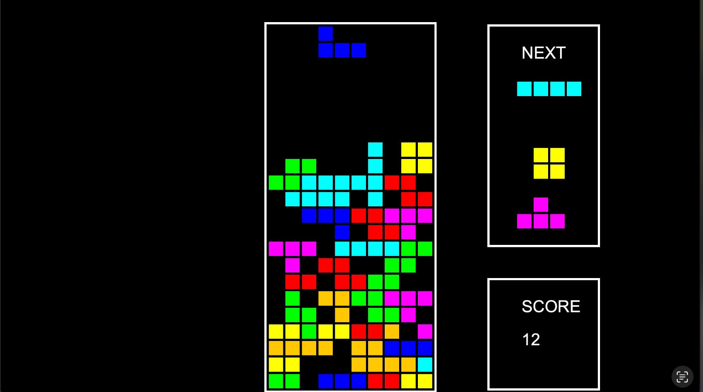

# Tetris Q-Learning Agent

This repository contains an implementation of a Q-learning based Tetris agent, `TetrisQAgent.java`, designed to learn and play the game of Tetris using reinforcement learning. This agent is built within a custom Tetris framework provided by Boston University (`edu.bu.tetris`).



---

## Overview

`TetrisQAgent` extends `QAgent` and implements a Q-learning algorithm using a neural network to approximate the Q-function. It observes the game state, extracts hand-crafted features, predicts Q-values for actions, and learns via experience replay and gradient descent.

---

## Core Components

### `initQFunction()`
Defines a feedforward neural network with the following:
- Input: 5-dimensional feature vector
- Architecture: Input → Dense → ReLU → Dense → Output (Q-value)

### `getQFunctionInput(GameView, Mino)`
Extracts features for the Q-function input:
- Base height of the stack
- Column bumpiness
- Empty cells beneath filled blocks
- Number of full rows
- Mino type (encoded numerically)

### `shouldExplore(GameView, GameCounter)`
Controls exploration using a decaying epsilon strategy to balance exploration and exploitation over time.

### `getExplorationMove(GameView)`
Selects a move probabilistically using softmax-normalized Q-values, favoring higher-value moves while allowing some randomness.

### `trainQFunction(Dataset, LossFunction, Optimizer, long)`
Performs Q-function training over minibatches using experience replay and gradient descent updates.

### `getReward(GameView)`
Computes a reward signal for learning based on:
- Score earned this turn
- Number of full rows cleared
- Number of gaps and uneven columns
- Height of the topmost block

---

## Features

- Hand-crafted state representation for faster and more interpretable learning
- Decaying epsilon for adaptive exploration
- Softmax-based probabilistic move selection
- Customizable reward function to reflect nuanced game progress
- Full integration with BU’s `TrainerAgent`, `Model`, `Dataset`, and `Matrix` libraries

---

## Usage

1. Place the file in the appropriate `agents` directory of your BU Tetris framework.
2. Run the simulation using `TrainerAgent` with this Q-learning agent.
3. Adjust hyperparameters, reward design, and features to optimize performance over training episodes.

---

## Dependencies

- BU Tetris environment
- Custom libraries from `edu.bu.tetris`, including:
  - `nn`
  - `game`
  - `agents`
  - `training`
  - `utils`

---

## How to Run

```bash
java -cp "./lib/*:." edu.bu.tetris.Main -q src.pas.tetris.agents.TetrisQAgent | tee my_logfile.log 


